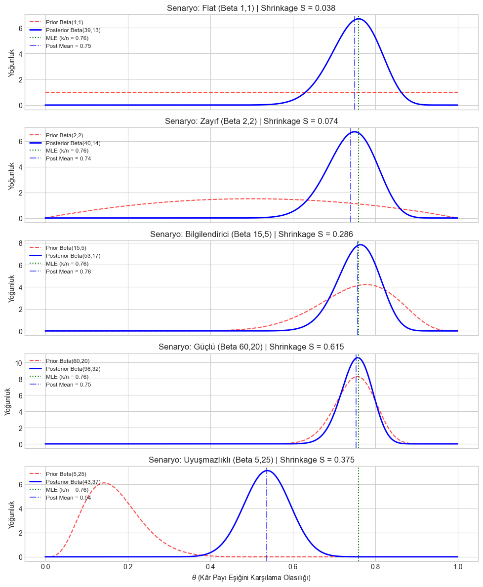

# Bayesian Prior Sensitivity Analysis (Beta-Binom Temelli)

> Tek bir posterior örnekleminden, farklı önsel (prior) varsayımlarının sonuçları
> ne kadar sürüklediğini ölçen, katılım bankacılığı bağlamında bir kâr-payı
> yeterlilik olasılığı örneği üzerinden gösteren eğitici bir Bayesyen istatistik
> kütüphanesi.

<p align="center">
  
</p>

---

## Neden Önemli?

Bir katılım bankasının yatırım hesabı ürününde, "*bu hesap beklenen kâr payı
eşiğini karşılayacak mı?*" sorusunun cevabı bir olasılık parametresi θ ile
temsil edilir. Az sayıda gözlem (örneğin 8-12 dönem) elindeyken, seçtiğin
önsel dağılım — istemeden bile — sonucu domine edebilir. Bu proje, "önselim
sonucu ne kadar sürüklüyor?" sorusuna **matematiksel olarak kesin bir cevap**
verir; kararı tesadüfe bırakmaz.

## Matematiksel Sezgi

Beta(a,b) önseli ve Binom olabilirlik altında sonsal analitik olarak
güncellenir. Önselin sonsal üzerindeki etkisi, büzülme faktörü **S** ile
ölçülür:

```
S = (a + b) / (a + b + n)
```

- **S → 1**: Önsel baskın (yüksek duyarlılık, veri az veya önsel çok güçlü)
- **S → 0**: Veri baskın (önsel gürbüz, sonuç güvenilir)

n=50 gözlem, k=38 "eşik karşılandı" durumunda beş farklı önsel senaryosu
karşılaştırıldığında:

| Senaryo | Önsel | Shrinkage (S) | Posterior Ortalama |
|---|---|---|---|
| Flat | Beta(1,1) | 0.038 | 0.75 |
| Zayıf | Beta(2,2) | 0.074 | 0.74 |
| Bilgilendirici | Beta(15,5) | 0.286 | 0.76 |
| Güçlü | Beta(60,20) | 0.615 | 0.75 |
| Uyuşmazlıklı | Beta(5,25) | 0.375 | 0.54 |

Uyuşmazlıklı senaryo, veriden (MLE=0.76) belirgin şekilde farklı bir sonuca
(0.54) yol açıyor — tam da bu proje bu tip sürüklenmeleri **erken tespit
etmek** için var.

## Kurulum

```bash
git clone https://github.com/<kullanici-adin>/prior-sensitivity-lab.git
cd prior-sensitivity-lab
python -m venv .venv
.venv\Scripts\activate        # Windows
pip install -e .
pytest tests/ -v              # 20/20 test geçmeli
```

## Hızlı Başlangıç

```python
from prior_sensitivity_lab.domain.beta_binomial import posterior_params, shrinkage
from prior_sensitivity_lab.domain.kl import kl_divergence

# Flat önsel ile n=50, k=38 gözlem
a_post, b_post = posterior_params(a=1, b=1, k=38, n=50)
s = shrinkage(a=1, b=1, n=50)

print(f"Posterior: Beta({a_post}, {b_post}), Shrinkage: {s:.3f}")
```

## Proje Yapısı

```
prior-sensitivity-lab/
├── docs/
│   ├── math_theory.md       # KL, CJS, Wasserstein türevleri
│   ├── interpretation.md    # Metriklerin nasıl okunacağı + bilinen sınırlamalar
│   └── images/
├── notebooks/
│   ├── 01_beta_binomial_analytic.ipynb
│   └── 02_non_conjugate_psis.ipynb
├── src/prior_sensitivity_lab/domain/
│   ├── beta_binomial.py     # Analitik güncelleme, shrinkage
│   ├── kl.py / js.py / wasserstein.py   # Mesafe fonksiyonları
│   ├── power_scaling.py     # Analitik + önem-örneklemesi güç ölçekleme
│   └── psis.py              # Pareto k̂ güvenilirlik teşhisi
└── tests/                   # 20 test, tam kapsam
```

## Bulgular

- **Mesafe metrikleri farklı şeyler ölçer**: KL ve Wasserstein sıralamaları
  bazen ters düşer (bkz. `docs/interpretation.md`) — KL şekil farkına duyarlı,
  Wasserstein çoğunlukla konum (mean) kaymasını yakalıyor.
- **Analitik güç-ölçekleme, önem-örneklemesi (IS) ile α ∈ [0.1, 15] aralığında
  yüksek doğrulukla örtüşüyor** — tek bir örneklemden tedirgin edilmiş
  posterior'ların simüle edilebileceğinin somut kanıtı.

### Bilinen Sınırlama

Dar posterior + düşük eğimli önsel yoğunluk kombinasyonunda, güç-ölçekli
ağırlıkların kuyruğu yeterince ayrışmıyor ve `genpareto.fit` kararsız şekil
parametrelerine yakınsayabiliyor. Kök neden: örneklem uzayının (θ posterior'dan
çekiliyor) tedirginlik kaynağıyla (önsel yoğunluğu) yeterince örtüşmemesi.
Gelecek çalışma: exceedances ölçeklendirme veya doğrudan önselden örnekleme.

## DCR Framework'e Köprü

Bu proje, **Bayesian Dynamic DCR Framework**'ün (Displaced Commercial Risk,
Dynamic Alpha tahmini) ilk metodolojik adımıdır:

- Beta-Binom modeli analitik çözülüyor çünkü tek, statik bir θ var.
- Dynamic Alpha, zamanla değişen ve muhtemelen hesap/dönem bazında
  hiyerarşik yapı taşıyan bir parametre olacağı için sonsal kapalı formda
  **çözülemeyecek** — bu nedenle MCMC (HMC/NUTS) gerekecek.
- Burada öğrenilen güç-ölçekleme mantığı hiyerarşik modellere taşınırken,
  yalnızca **en üst seviye hiperparametrelerin** ölçeklenmesi gerekiyor;
  aksi halde çift-tedirginme (double-scaling) hatası oluşur.

## Yol Haritası

- [ ] Hiyerarşik genelleme için teorik taslak (`docs/hierarchical_extension.md`)
- [ ] PyMC ile karşılaştırmalı MCMC implementasyonu
- [ ] ArviZ veri yapılarına geçiş

## Lisans

MIT
